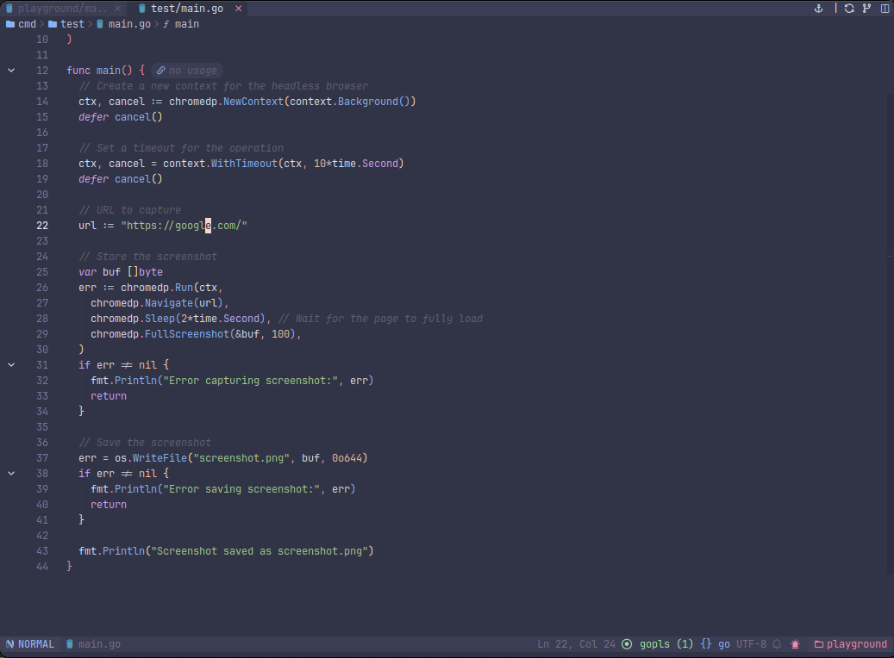
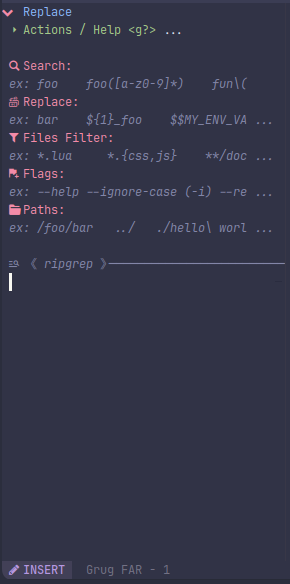

<h1 align="center">My NvChad configuration</h1>

Powered by <a href="https://github.com/NvChad/NvChad">NvChad</a> v2.5

</h3>

## Introduction

I do not own anything related to NvChad, this is only the configs that I use with it.

I have been a VSCode user for years and I am slowly moving forward to `nvim`, so this is my config that mimics `VSCode` key binds and UI, with a goal of removing plugins as I am getting used to it and learning more about `nvim`.

## Installation guide

1. Same as [NvChad](https://nvchad.com/docs/quickstart/install)
2. I am using `Hack Nerd Font`
3. My terminal is `WezTerm`

## Help

For questions feel free to open an issue or you can find me in the [NvChad discord](https://discord.com/invite/gADmkJb9Fb) server.

## Configured environments

- [x] Lua
- [x] Go
- [x] Web development (JS, TS, HTML, CSS, React, Astro)
- [x] Markdown (Obsidian)

TreeSitter is enabled and will automatically install parsers for you.

## Blink.cmp

If Cmp is visible, you can use `<Esc>` to close it without leaving `Insert` mode.

If the copilot suggestion is active, you can use `<Tab>` to select the copilot option.

## Folding in VSCode style

_With [UFO](https://github.com/kevinhwang91/nvim-ufo)_

## Diagnostics in a VSCode style

### Diagnostics Tab

_With [Trouble](https://github.com/folke/trouble.nvim)_

## TODO Tracking

_With [Todo-comments](https://github.com/folke/todo-comments.nvim)_

## Search and replace

### Local Search

_With [SearchBox](https://github.com/VonHeikemen/searchbox.nvim)_

### Global Search and Replace

_With [Grug Far](https://github.com/MagicDuck/grug-far.nvim)_

## Custom Statusline tweaks

1. Recording a macro status
2. Colored icons for the file icon.
3. A Git icon with the status of the copilot lsp
4. Connected LSP servers

## Custom Tabufline icons

From left to right:

1. GitHub UI (on click will open `LazyGit` window)
2. Split window button (on click will split the current window vertically)

## Keybinds
All the keybindings are available in the `mappings.lua` file, and also described in the `NVCheatSheet`, you can access it with `<leader>ch`.

Common Text key binds are also available:

- Ctrl + A: Select All
- Ctrl + X: Cut
- Ctrl + C: Copy
- Ctrl + V: Paste
- Ctrl + Z: Undo

## Formatting

Formatting is handled by `Conform` and I do not like the format on save, so my config is set to format on `<leader>fm` only, but you can change it to whatever you want, to do it, just uncomment the autocmd in the `autocmd.lua` file.

## Other plugins

- Auto save with [auto-save](https://github.com/Pocco81/auto-save.nvim)
- UI overhaul with [Noice](https://github.com/folke/noice.nvim)
- UI Improvement with [Telescope-ui-select](https://github.com/nvim-telescope/telescope-ui-select.nvim)
- Arguments highlights with [hlargs](https://github.com/m-demare/hlargs.nvim)

