<h1 align="center">Nvim(Chad) configuration</h1>

Custom config for <a href="https://github.com/NvChad/NvChad">git@github.com:NvChad/NvChad</a>

<h3 align="center">

    
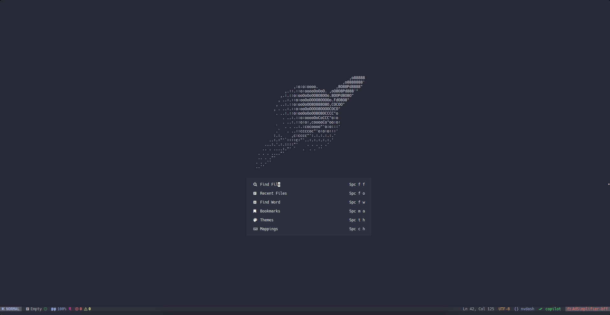

</h3>

## Introduction

I have been a VSCode user for years and I am slowly moving forward to `NVIM`, so this is my config that mimic `VSCode` keybinds and UI, with a goal from removing plugins as I am getting used to it and learning more about `NVIM`.

## Instalation guide

1. Same as [NvChad](https://nvchad.com/docs/quickstart/install)
2. Download and install [CTAGS](https://github.com/universal-ctags/ctags)
3. I am using `Hack Nerd Font`
4. My terminal is `WezTerm`
5. My neovim version is `nightly`
6. I am using a M1, so some things may not work out of the box for you

## Help

For questions feel free to open an issue or you can find me in the [NvChad discord](https://discord.com/invite/gADmkJb9Fb) server.

## Configured environments

- [x] Lua
- [x] Go ([go.nvim](https://github.com/ray-x/go.nvim))
- [x] JavaScript

## CMP fully integrated with AI completion

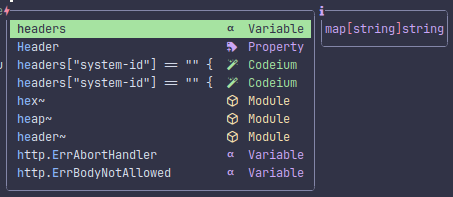

You can navigate between the options with `<Up>` and `<Down>` and select with `<CR>`.

If copilot suggestion is active, you can use `<Tab>` to select the copilot option.

## Code foldable in a VSCode style

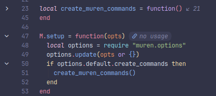

_With [UFO](https://github.com/kevinhwang91/nvim-ufo), [Pretty Fold](https://github.com/anuvyklack/pretty-fold.nvim)_

## Diagnostics in a VSCode style

### Diagnostics tab

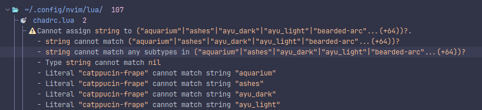

_With [Trouble](https://github.com/folke/trouble.nvim)_

### Diagnostics in the gutter

_With [Error Lens](https://github.com/chikko80/error-lens.nvim)_

### Diagnostics with LSP Lines

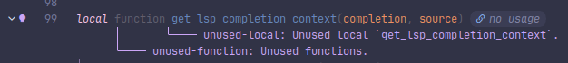

_With [lsp-lines](https://github.com/ErichDonGubler/lsp_lines.nvim)_

LSP Lines is only enabled for Go, so it may need some tweaking for other languages.

### Diagnostics in scrollbar

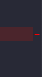

_With [nvim-scrollbar](https://github.com/petertriho/nvim-scrollbar)_

## Winbar

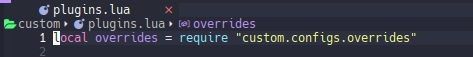

_With [LSPSaga](https://github.com/nvimdev/lspsaga.nvim) or [Dropbar](https://github.com/Bekaboo/dropbar.nvim)_

If you do not use neovim `nightly`, you should disable the plugin `dropbar.lua` and then enable the lspsaga winbar in `lspsaga.lua`.

## Word highlight

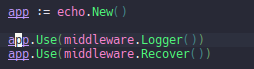

_With [Illuminate](https://github.com/RRethy/vim-illuminate)_

## TODO Tracking

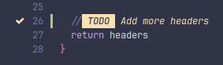

_With [Todo-comments](https://github.com/folke/todo-comments.nvim)_

## Context

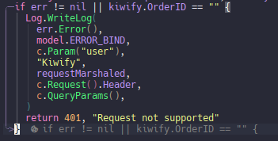

_With [Biscuits](https://github.com/code-biscuits/nvim-biscuits)_

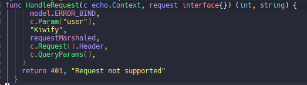

_With [ts-context](https://github.com/nvim-treesitter/nvim-treesitter-context)_

## Search and replace

### Local Search

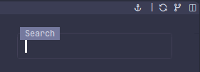

_With [SearchBox](https://github.com/VonHeikemen/searchbox.nvim)_

### Local Rename

_With [IncRename](https://github.com/smjonas/inc-rename.nvim)_

### Global rename

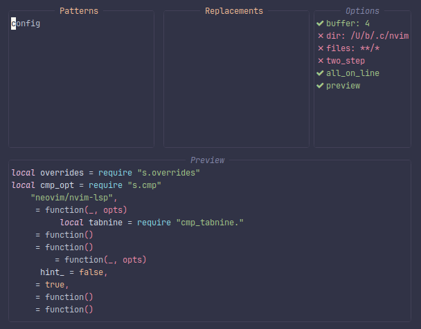

_With [Muren](https://github.com/AckslD/muren.nvim)_

## Bookmarks

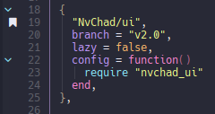

_With [Bookmark](https://github.com/MattesGroeger/vim-bookmarks)_

## Telescope Integrations

- Telescope frequent files `<leader>fr` (with [telescope-frecency](https://github.com/nvim-telescope/telescope-frecency.nvim))
- Telescope undo tree `<leader>fu` (with [telescope-undo](https://github.com/debugloop/telescope-undo.nvim))
- Telescope fuzzy native (with [telescope-fzf-native](https://github.com/nvim-telescope/telescope-fzf-native.nvim))

## Custom Statusline icons

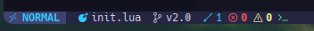

From left to right:

1. Github copilot status (it shows if copilot is active or not)
2. Harpoon file navigation (it shows if harpoon is harpooned or not)
3. Battery status (usefull when using in fullscreen)
4. Session status (icon for Possession plugin)

## Keybinds

All the keybinds are available in the `mappings.lua` file, and also described in the NVCheatSheet, you can access it with `<leader>ch`.

## Formatting

I do not like format on save, so my config is set to format on `<leader>fm` only, but you can change it to whatever you want, to do it, just uncomment the autocmd in the `autocmd.lua` file.

For `.go` files, you can use `<leader>fi` to complete imports.

## Improved GoToDefinition

I am using universal CTAGS to have a better GoToDefinition, the tags are generated automatically with [guttentags](https://github.com/ludovicchabant/vim-gutentags).
Keybind to use is `<C-]>`.

## Github

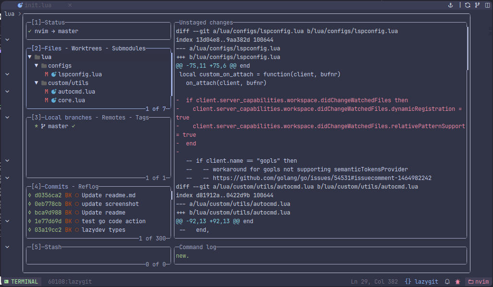

_With [LazyGit](https://github.com/kdheepak/lazygit.nvim)_

## Theme

I have adapted the Evondev Dracula theme from VSCode to Neovim, you can find it in the `theme` folder.

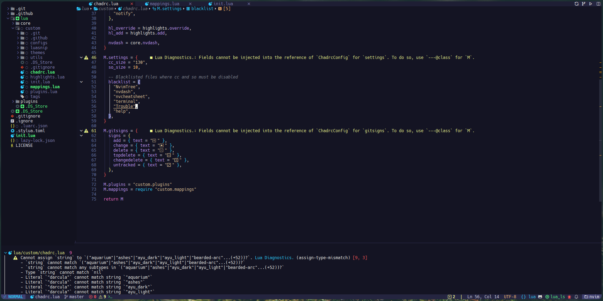

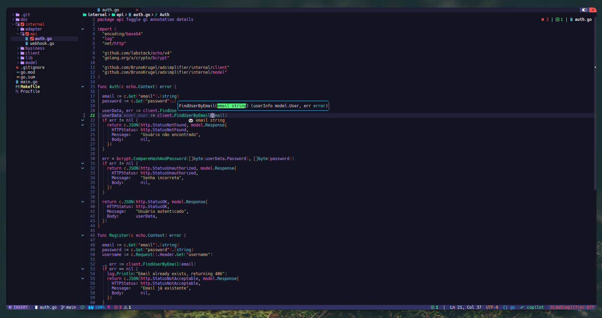

## Neovide

Config ready for neovide, options are available in the `neovide.lua` file.

## Other plugins

- Auto save with [auto-save](https://github.com/Pocco81/auto-save.nvim)
- UI overhaul with [Noice](https://github.com/folke/noice.nvim)
- UI Improvement with [Telescope-ui-select](https://github.com/nvim-telescope/telescope-ui-select.nvim)
- Arguments highlights with [hlargs](https://github.com/m-demare/hlargs.nvim)
- Quick file navigation with [Harpoon](https://github.com/ThePrimeagen/harpoon)
