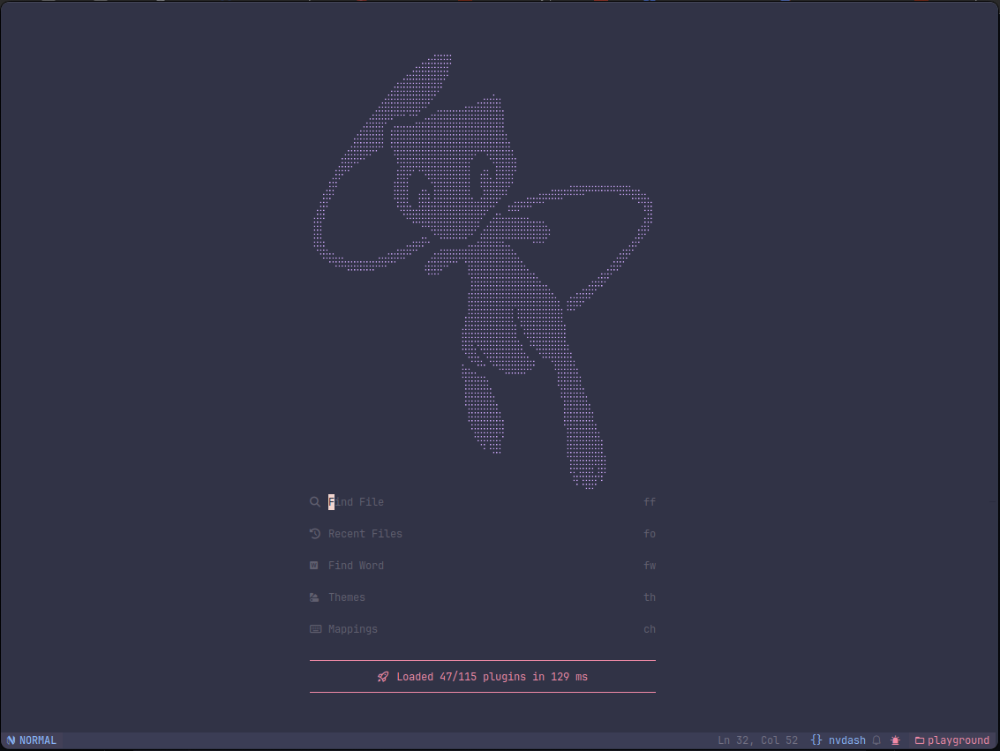

<h1 align="center">Nvim(Chad) configuration</h1>

Custom config for <a href="https://github.com/NvChad/NvChad">NvChad</a> v3.0

    
    
    
    

</h3>

## Introduction

I do not own anything related to NvChad, this is only my configs that I use with it.

I have been a VSCode user for years and I am slowly moving forward to `NVIM`, so this is my config that mimic `VSCode` key binds and UI, with a goal of removing plugins as I am getting used to it and learning more about `NVIM`.

## Installation guide

1. Same as [NvChad](https://nvchad.com/docs/quickstart/install) (I am using the WIP 3.0 version of NvChad)
2. After installing NvChad, clone this repo inside your custom NvChad folder.
3. Download and install [CTAGS](https://github.com/universal-ctags/ctags) (for a better Go To Definition)
4. I am using `Hack Nerd Font`
5. My terminal is `WezTerm`
6. I am using a M1, so, some things may not work out of the box for you

## Help

For questions feel free to open an issue or you can find me in the [NvChad discord](https://discord.com/invite/gADmkJb9Fb) server.

## Configured environments

- [x] Lua
- [x] Go ([go.nvim](https://github.com/ray-x/go.nvim))
- [x] Web development (JS, TS, HTML, CSS, React, Astro)
- [x] Markdown

## Language Servers installed

- astro
- clangd
- cssls
- dockerls
- emmet_ls
- eslint
- gopls
- grammarly
- html
- jdtls
- jsonls
- marksman
- tsserver
- yamlls

TreeSitter is enabled and will automatically install parsers for you.

## CMP fully integrated with AI completions

Cmp has some custom configs for performance, and it will open automatically.

You can disable cmp auto complete with cmd `CmpToggle`.

To trigger it, press `<C-Space>`, you can navigate between the options with `<Up>` and `<Down>` and select with `<CR`>`.

If Cmp is visible, you can use `<Esc>` to close it without leaving `Insert` mode.

If the copilot suggestion is active, you can use `<Tab>` to select the copilot option.

## Code foldable in a VSCode style

_With [UFO](https://github.com/kevinhwang91/nvim-ufo), [Pretty Fold](https://github.com/anuvyklack/pretty-fold.nvim)_

## Diagnostics in a VSCode style

### Diagnostics Tab

_With [Trouble](https://github.com/folke/trouble.nvim)_

### Diagnostics in the gutter

_With [Error Lens](https://github.com/chikko80/error-lens.nvim)_

### Diagnostics with LSP Lines

_With [lsp-lines](https://github.com/ErichDonGubler/lsp_lines.nvim)_

LSP Lines is only configured for `Go`, so it may need some tweaking for other languages.

### Diagnostics in scrollbar

_With [nvim-scrollbar](https://github.com/petertriho/nvim-scrollbar)_

## Winbar

_With [LSPSaga](https://github.com/nvimdev/lspsaga.nvim)

## Word highlight

_With [Illuminate](https://github.com/RRethy/vim-illuminate)_

## TODO Tracking

_With [Todo-comments](https://github.com/folke/todo-comments.nvim)_

## Search and replace

### Local Search

_With [SearchBox](https://github.com/VonHeikemen/searchbox.nvim)_

### Local Rename

_With [IncRename](https://github.com/smjonas/inc-rename.nvim)_

### Global rename

_With [Muren](https://github.com/AckslD/muren.nvim)_

## Telescope Integrations

- Telescope frequent files `<leader>fr` (with [telescope-frecency](https://github.com/nvim-telescope/telescope-frecency.nvim))
- Telescope undo tree `<leader>fu` (with [telescope-undo](https://github.com/debugloop/telescope-undo.nvim))
- Telescope fuzzy native (with [telescope-fzf-native](https://github.com/nvim-telescope/telescope-fzf-native.nvim))

## Custom Statusline tweaks

1. It will show when it's recording a macro.
2. It will show a custom icon when the file is hooked by Harpoon.
3. It will show colored icons for file icon.
4. It will show a Git icon with the status of the copilot

## Custom Tabufline icons

From left to right:

1. GitHub UI (on click will open `LazyGit` window)
2. Compiler and Run (on click will open `Compiler.nvim`)
3. Split window button (on click will split the current window vertically)

## References

_With [Glance](https://github.com/DNLHC/glance.nvim)_

## Keybinds

All the keybinds are available in the `mappings.lua` file, and also described in the NVCheatSheet, you can access it with `<leader>ch`.

Commom Text keybinds are also available:

- Ctrl + A Select All
- Ctrl + X Cut
- Ctrl + C Copy
- Ctrl + V Paste
- Ctrl + Z Undo

## Formatting

I do not like format on save, so my config is set to format on `<leader>fm` only, but you can change it to whatever you want, to do it, just uncomment the autocmd in the `autocmd.lua` file.

For `.go` files, you can use `<leader>fi` to complete imports.

## Improved GoToDefinition

I am using universal CTAGS to have a better GoToDefinition, the tags are generated automatically with [guttentags](https://github.com/ludovicchabant/vim-gutentags).
Keybind to use is `<C-]>`.

## Github

_With [LazyGit](https://github.com/kdheepak/lazygit.nvim)_

## Colorpicker tool

_With [Colortils](https://github.com/nvim-colortils/colortils.nvim)_

## Neovide

Config ready for neovide, options are available in the `options.lua` file.

## Other plugins

- Auto save with [auto-save](https://github.com/Pocco81/auto-save.nvim)
- UI overhaul with [Noice](https://github.com/folke/noice.nvim)
- UI Improvement with [Telescope-ui-select](https://github.com/nvim-telescope/telescope-ui-select.nvim)
- Arguments highlights with [hlargs](https://github.com/m-demare/hlargs.nvim)
- Quick file navigation with [Harpoon](https://github.com/ThePrimeagen/harpoon)
- Minimap with [Codewindow](https://github.com/gorbit99/codewindow.nvim)

## Plugins

Full List

### bars-and-lines

- [luukvbaal/statuscol.nvim](https://dotfyle.com/plugins/luukvbaal/statuscol.nvim)

### code-runner

- [stevearc/overseer.nvim](https://dotfyle.com/plugins/stevearc/overseer.nvim)
- [Zeioth/compiler.nvim](https://dotfyle.com/plugins/Zeioth/compiler.nvim)

### color

- [NvChad/nvim-colorizer.lua](https://dotfyle.com/plugins/NvChad/nvim-colorizer.lua)

### comment

- [JoosepAlviste/nvim-ts-context-commentstring](https://dotfyle.com/plugins/JoosepAlviste/nvim-ts-context-commentstring)
- [folke/todo-comments.nvim](https://dotfyle.com/plugins/folke/todo-comments.nvim)

### completion

- [zbirenbaum/copilot.lua](https://dotfyle.com/plugins/zbirenbaum/copilot.lua)
- [hrsh7th/nvim-cmp](https://dotfyle.com/plugins/hrsh7th/nvim-cmp)

### cursorline

- [mawkler/modicator.nvim](https://dotfyle.com/plugins/mawkler/modicator.nvim)
- [RRethy/vim-illuminate](https://dotfyle.com/plugins/RRethy/vim-illuminate)

### debugging

- [rcarriga/nvim-dap-ui](https://dotfyle.com/plugins/rcarriga/nvim-dap-ui)
- [mfussenegger/nvim-dap](https://dotfyle.com/plugins/mfussenegger/nvim-dap)
- [andrewferrier/debugprint.nvim](https://dotfyle.com/plugins/andrewferrier/debugprint.nvim)

### dependency-management

- [vuki656/package-info.nvim](https://dotfyle.com/plugins/vuki656/package-info.nvim)

### diagnostics

- [folke/trouble.nvim](https://dotfyle.com/plugins/folke/trouble.nvim)

### editing-support

- [debugloop/telescope-undo.nvim](https://dotfyle.com/plugins/debugloop/telescope-undo.nvim)
- [anuvyklack/pretty-fold.nvim](https://dotfyle.com/plugins/anuvyklack/pretty-fold.nvim)
- [nvim-treesitter/nvim-treesitter-context](https://dotfyle.com/plugins/nvim-treesitter/nvim-treesitter-context)
- [folke/zen-mode.nvim](https://dotfyle.com/plugins/folke/zen-mode.nvim)
- [windwp/nvim-ts-autotag](https://dotfyle.com/plugins/windwp/nvim-ts-autotag)
- [gbprod/cutlass.nvim](https://dotfyle.com/plugins/gbprod/cutlass.nvim)
- [Wansmer/treesj](https://dotfyle.com/plugins/Wansmer/treesj)
- [chrisgrieser/nvim-various-textobjs](https://dotfyle.com/plugins/chrisgrieser/nvim-various-textobjs)
- [okuuva/auto-save.nvim](https://dotfyle.com/plugins/okuuva/auto-save.nvim)
- [ethanholz/nvim-lastplace](https://dotfyle.com/plugins/ethanholz/nvim-lastplace)

### fuzzy-finder

- [nvim-telescope/telescope.nvim](https://dotfyle.com/plugins/nvim-telescope/telescope.nvim)

### git

- [kdheepak/lazygit.nvim](https://dotfyle.com/plugins/kdheepak/lazygit.nvim)
- [f-person/git-blame.nvim](https://dotfyle.com/plugins/f-person/git-blame.nvim)
- [sindrets/diffview.nvim](https://dotfyle.com/plugins/sindrets/diffview.nvim)

### golang

- [ray-x/go.nvim](https://dotfyle.com/plugins/ray-x/go.nvim)

### icon

- [ziontee113/icon-picker.nvim](https://dotfyle.com/plugins/ziontee113/icon-picker.nvim)

### indent

- [shellRaining/hlchunk.nvim](https://dotfyle.com/plugins/shellRaining/hlchunk.nvim)
- [lukas-reineke/indent-blankline.nvim](https://dotfyle.com/plugins/lukas-reineke/indent-blankline.nvim)

### keybinding

- [anuvyklack/keymap-amend.nvim](https://dotfyle.com/plugins/anuvyklack/keymap-amend.nvim)
- [max397574/better-escape.nvim](https://dotfyle.com/plugins/max397574/better-escape.nvim)
- [folke/which-key.nvim](https://dotfyle.com/plugins/folke/which-key.nvim)

### lsp

- [smjonas/inc-rename.nvim](https://dotfyle.com/plugins/smjonas/inc-rename.nvim)
- [jose-elias-alvarez/null-ls.nvim](https://dotfyle.com/plugins/jose-elias-alvarez/null-ls.nvim)
- [neovim/nvim-lspconfig](https://dotfyle.com/plugins/neovim/nvim-lspconfig)
- [weilbith/nvim-code-action-menu](https://dotfyle.com/plugins/weilbith/nvim-code-action-menu)
- [VidocqH/lsp-lens.nvim](https://dotfyle.com/plugins/VidocqH/lsp-lens.nvim)
- [ray-x/lsp_signature.nvim](https://dotfyle.com/plugins/ray-x/lsp_signature.nvim)
- [nvimdev/lspsaga.nvim](https://dotfyle.com/plugins/nvimdev/lspsaga.nvim)
- [jinzhongjia/LspUI.nvim](https://dotfyle.com/plugins/jinzhongjia/LspUI.nvim)

### lsp-installer

- [williamboman/mason.nvim](https://dotfyle.com/plugins/williamboman/mason.nvim)

### markdown-and-latex

- [toppair/peek.nvim](https://dotfyle.com/plugins/toppair/peek.nvim)

### marks

- [ThePrimeagen/harpoon](https://dotfyle.com/plugins/ThePrimeagen/harpoon)

### media

- [samodostal/image.nvim](https://dotfyle.com/plugins/samodostal/image.nvim)

### motion

- [phaazon/hop.nvim](https://dotfyle.com/plugins/phaazon/hop.nvim)

### nvim-dev

- [ray-x/guihua.lua](https://dotfyle.com/plugins/ray-x/guihua.lua)
- [kkharji/sqlite.lua](https://dotfyle.com/plugins/kkharji/sqlite.lua)
- [folke/neodev.nvim](https://dotfyle.com/plugins/folke/neodev.nvim)
- [MunifTanjim/nui.nvim](https://dotfyle.com/plugins/MunifTanjim/nui.nvim)
- [nvim-lua/plenary.nvim](https://dotfyle.com/plugins/nvim-lua/plenary.nvim)

### scrollbar

- [gorbit99/codewindow.nvim](https://dotfyle.com/plugins/gorbit99/codewindow.nvim)
- [petertriho/nvim-scrollbar](https://dotfyle.com/plugins/petertriho/nvim-scrollbar)

### scrolling

- [karb94/neoscroll.nvim](https://dotfyle.com/plugins/karb94/neoscroll.nvim)

### search

- [AckslD/muren.nvim](https://dotfyle.com/plugins/AckslD/muren.nvim)
- [kevinhwang91/nvim-hlslens](https://dotfyle.com/plugins/kevinhwang91/nvim-hlslens)

### session

- [rmagatti/auto-session](https://dotfyle.com/plugins/rmagatti/auto-session)

### snippet

- [TobinPalmer/rayso.nvim](https://dotfyle.com/plugins/TobinPalmer/rayso.nvim)
- [L3MON4D3/LuaSnip](https://dotfyle.com/plugins/L3MON4D3/LuaSnip)

### split-and-window

- [nvim-zh/colorful-winsep.nvim](https://dotfyle.com/plugins/nvim-zh/colorful-winsep.nvim)

### syntax

- [m-demare/hlargs.nvim](https://dotfyle.com/plugins/m-demare/hlargs.nvim)
- [nvim-treesitter/nvim-treesitter](https://dotfyle.com/plugins/nvim-treesitter/nvim-treesitter)

### terminal-integration

- [m00qek/baleia.nvim](https://dotfyle.com/plugins/m00qek/baleia.nvim)

### test

- [nvim-neotest/neotest](https://dotfyle.com/plugins/nvim-neotest/neotest)

### utility

- [zbirenbaum/neodim](https://dotfyle.com/plugins/zbirenbaum/neodim)
- [anuvyklack/fold-preview](https://dotfyle.com/plugins/anuvyklack/fold-preview)
- [yaocccc/nvim-foldsign](https://dotfyle.com/plugins/yaocccc/nvim-foldsign)
- [code-biscuits/nvim-biscuits](https://dotfyle.com/plugins/code-biscuits/nvim-biscuits)
- [folke/noice.nvim](https://dotfyle.com/plugins/folke/noice.nvim)
- [rcarriga/nvim-notify](https://dotfyle.com/plugins/rcarriga/nvim-notify)
- [echasnovski/mini.nvim](https://dotfyle.com/plugins/echasnovski/mini.nvim)
- [nguyenvukhang/nvim-toggler](https://dotfyle.com/plugins/nguyenvukhang/nvim-toggler)
- [kevinhwang91/nvim-ufo](https://dotfyle.com/plugins/kevinhwang91/nvim-ufo)

